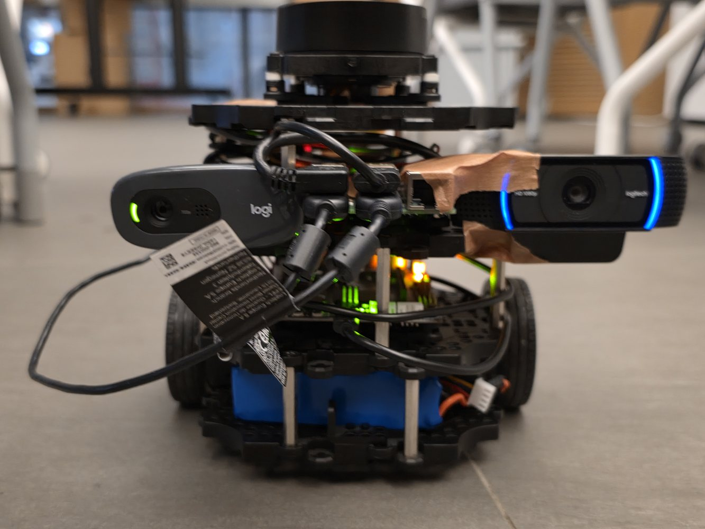
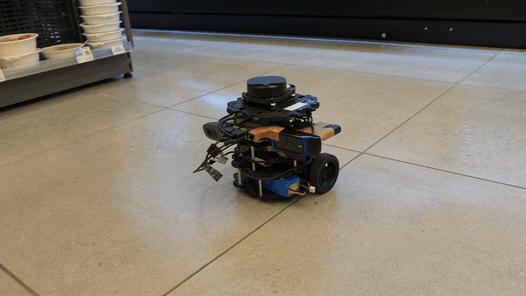
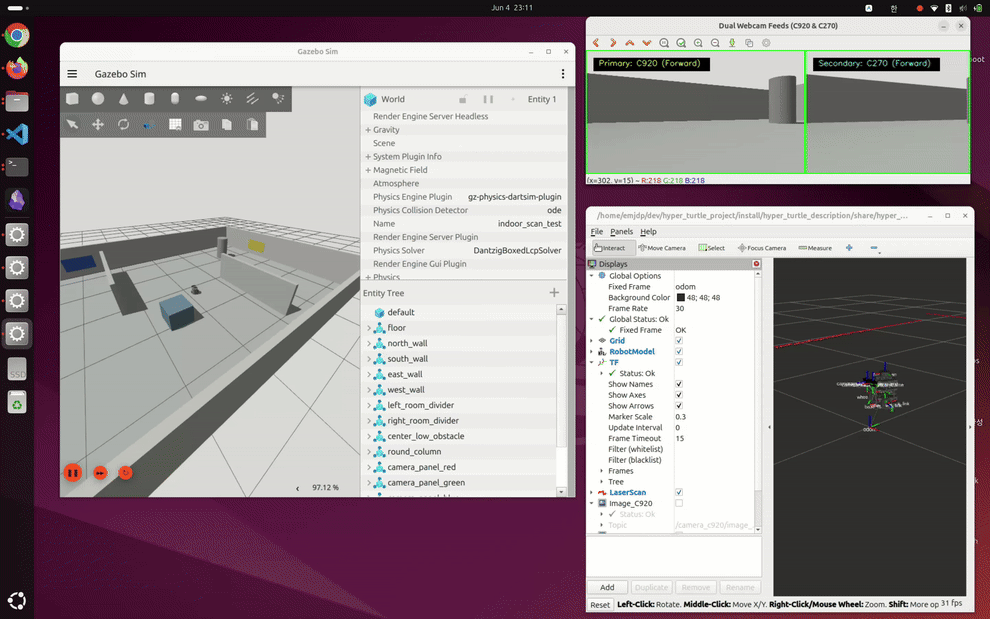
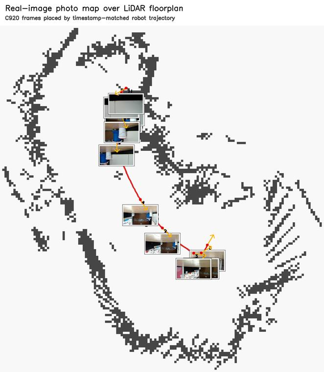
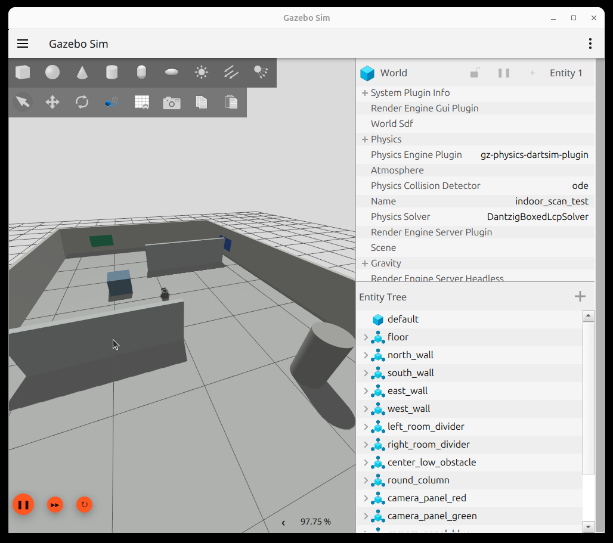
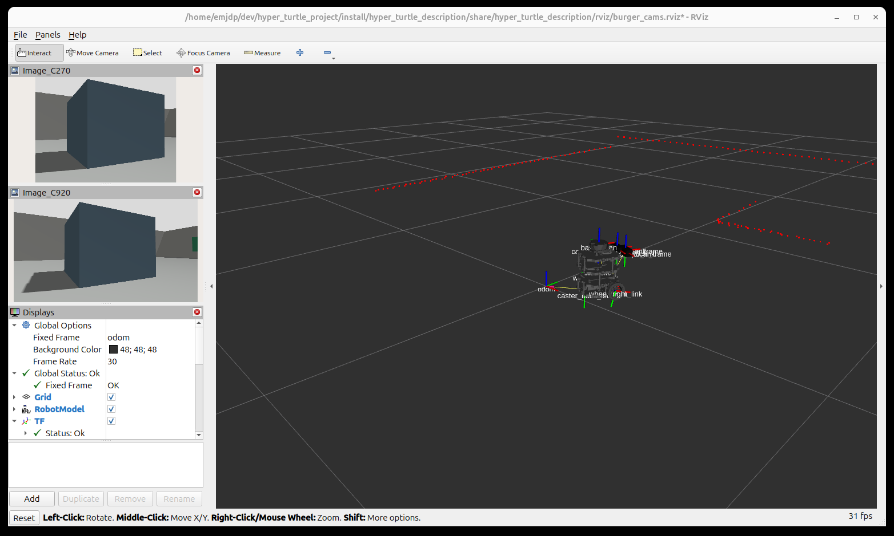
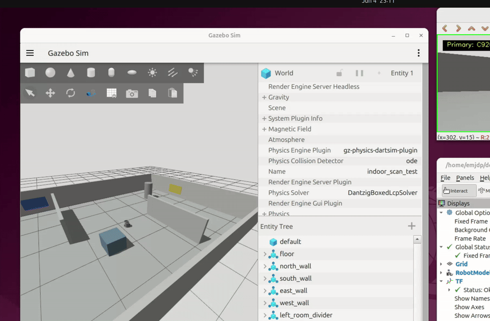

# Hyper Turtle Project

### TurtleBot3 Burger + Dual Webcams + LDS-01 for indoor scan, mapping, and visual reconstruction

[](https://docs.ros.org/en/jazzy/)
[](https://releases.ubuntu.com/24.04/)
[](https://gazebosim.org/)
[](https://emanual.robotis.com/docs/en/platform/turtlebot3/overview/)


Hyper Turtle Project는 TurtleBot3 Burger에 Logitech C920/C270 웹캠 2대와 LDS-01 2D LiDAR를 결합해 실내 공간을 주행, 기록, 재구성하는 ROS 2 Jazzy 프로젝트입니다. 시뮬레이션에서 센서/TF/토픽 계약을 먼저 맞춘 뒤, 실물 로봇에서 조이스틱 주행과 rosbag 기록까지 검증했습니다.



> 핵심 목표: 저가형 TurtleBot3와 USB 웹캠 2대로 "주행 가능한 데이터 수집 로봇"을 만들고, LiDAR/odom/카메라 bag을 후처리해 시각적 3D map 결과까지 연결한다.

---

## Results at a Glance

| Real robot | Simulation stack |
| :---: | :---: |
|  |  |
| Joystick-driven TurtleBot3 Burger with dual webcams and LDS-01 | Gazebo, RViz, and dual camera streams running together |

| Edge-textured 3D map | LiDAR floorplan | C920 image overlay |
| :---: | :---: | :---: |
|  |  |  |

Additional result snapshots:

- [Simulation GIF: Gazebo + RViz + camera feeds](docs/images/readme_sim_three_windows.gif)
- [Real robot drive GIF](extracted_images/20260531_230324_github_23s.gif)
- [Image-stitched 3D map preview](extracted_images/Image_stitched_3D_map_preview.jpeg)
- [Multi-node stitched tour](extracted_images/Multi_node_stitched_tour.jpeg)
- [Desktop WebGL viewer result](<extracted_images/단일_stitched_WebGL_viewer_desktop.jpeg>)
- [Mobile viewer result](<extracted_images/최종_Edge_textured_3D_map_mobile.jpeg>)

Heavy artifacts such as `bags/`, `outputs/`, `build/`, `install/`, and `final_code/` are intentionally ignored. Reproducible commands and representative outputs are documented here; large run products should be regenerated locally.

---

## What This Repository Contains

| Package / path | Role |
|---|---|
| `src/hyper_turtle_description` | TurtleBot3 Burger URDF/SDF variants, dual mono webcam model, camera TF, RViz config |
| `src/hyper_turtle_bringup` | Gazebo simulation launch, real robot launch, ros_gz bridges, usb_cam configs |
| `src/hyper_turtle_control` | Xbox/joystick teleoperation config |
| `src/hyper_turtle_mapping` | SLAM Toolbox launch and map saving workflow |
| `src/hyper_turtle_navigation` | Nav2 follow-up notes and future navigation work |
| `src/hyper_turtle_perception` | Perception placeholder for future graffiti/damage detection |
| `scripts/robot` | Real robot deploy, SSH setup, bringup, joystick bridge, recording, bag fetch scripts |
| `scripts/pc` | PC/WSL joystick helper scripts |
| `docs/real_robot_joystick_runbook.md` | Real robot power, SSH, bringup, UDP joystick, bag record/fetch runbook |
| `docs/vision_data_handoff.md` | Bag topic, TF, timestamp, and camera pose contract for vision/post-processing |
| `docs/webcams_lds01_calibration_plan.md` | Dual webcam + LDS-01 integration and calibration plan |
| `docs/report` | Report/presentation artifacts moved out of the repository root |
| `extracted_images/` | Curated result images, GIFs, and demo media for README/reporting |

---

## Features

**Robot and sensing**

- TurtleBot3 Burger base with OpenCR, wheel odometry, IMU, `/scan`, `/odom`, `/tf`, and `/joint_states`.
- Dual Logitech webcams:
  - C920 primary camera: `/camera_c920/image_raw/compressed`
  - C270 secondary camera: `/camera_c270/image_raw/compressed`
- Camera optical frames follow ROS REP-103 optical convention.
- Simulation and real robot use matching topic/frame names wherever possible.

**Simulation**

- Gazebo Sim world for indoor scan testing.
- Dual forward-facing camera streams.
- RViz visualization for robot model, TF, LaserScan, and camera images.
- Xbox joystick teleop via `joy` + `teleop_twist_joy`.
- Headless switches for low-power or remote environments.

**Real robot operation**

- SSH-based robot bringup scripts.
- UDP joystick bridge for networks where DDS discovery between PC and robot is unreliable.
- `TwistStamped /cmd_vel` publishing for TurtleBot3 Jazzy compatibility.
- Clean `ros2 bag record` shutdown through a single foreground SSH process.
- Bag fetch script that uses `.last_bag` and verifies with `ros2 bag info`.

**Mapping and reconstruction**

- SLAM Toolbox workflow for 2D mapping.
- Bag contract for downstream vision teams.
- Edge-textured visual 3D map snapshots based on LiDAR/odom structure and C920 image texture.
- Documented limitations around uncalibrated CameraInfo, stereo scale instability, and odometry drift.

---

## System Overview

```text
                       Laptop / PC
        +---------------------------------------+
        | Gazebo Sim / RViz / joy_node          |
        | scripts/robot/run_pc_joystick.sh      |
        |  /joy -> UDP packets                  |
        +--------------------+------------------+
                             |
                             | UDP :9090
                             v
                    TurtleBot3 Burger / RPi
        +---------------------------------------+
        | scripts/robot/robot_bringup.sh        |
        |  turtlebot3_node  -> /odom /imu /tf   |
        |  LDS-01           -> /scan            |
        |  usb_cam x 2      -> /camera_c*/...   |
        |                                       |
        | scripts/robot/robot_cmd_bridge.sh     |
        |  UDP joystick -> TwistStamped /cmd_vel|
        |                                       |
        | scripts/robot/robot_record.sh         |
        |  ros2 bag record standard topic set   |
        +--------------------+------------------+
                             |
                             | rsync
                             v
        +---------------------------------------+
        | bags/                                 |
        | offline mapping, image extraction,    |
        | LiDAR/pose/image reconstruction       |
        +---------------------------------------+
```

### TF Tree

```text
map (optional, SLAM)
└── odom
    └── base_footprint
        └── base_link
            ├── base_scan
            ├── camera_c920_link
            │   └── camera_c920_optical_frame
            ├── camera_c270_link
            │   └── camera_c270_optical_frame
            ├── imu_link
            ├── wheel_left_link
            └── wheel_right_link
```

Current default camera mount values:

| Transform | Translation `(x, y, z)` m | Rotation `(roll, pitch, yaw)` rad |
|---|---:|---:|
| `base_link -> camera_c920_link` | `(0.075, 0.000, 0.135)` | `(0, 0, 0)` |
| `base_link -> camera_c270_link` | `(0.060, 0.035, 0.135)` | `(0, 0, 0)` |
| `camera_*_link -> camera_*_optical_frame` | `(0, 0, 0)` | `(-pi/2, 0, -pi/2)` |

The camera transforms are launch arguments, so the real mount can be corrected without changing source code.

---

## Requirements

| Component | Version / target |
|---|---|
| OS | Ubuntu 24.04 LTS |
| ROS | ROS 2 Jazzy |
| Simulator | Gazebo Sim / Harmonic through `ros_gz` |
| Robot | TurtleBot3 Burger |
| Cameras | Logitech C920 + Logitech C270 |
| LiDAR | TurtleBot3 LDS-01 |
| Controller | Xbox-compatible joystick |
| Python | Python 3.12 with venv using ROS site packages |

Install everything with the project script:

```bash
./install_dependencies.sh
```

Or install the main ROS packages manually:

```bash
sudo apt update
sudo apt install -y \
  ros-jazzy-turtlebot3 \
  ros-jazzy-turtlebot3-gazebo \
  ros-jazzy-turtlebot3-simulations \
  ros-jazzy-turtlebot3-teleop \
  ros-jazzy-ros-gz \
  ros-jazzy-ros-gz-bridge \
  ros-jazzy-ros-gz-sim \
  ros-jazzy-ros-gz-image \
  ros-jazzy-slam-toolbox \
  ros-jazzy-navigation2 \
  ros-jazzy-nav2-bringup \
  ros-jazzy-nav2-map-server \
  ros-jazzy-tf2-tools \
  ros-jazzy-rviz2 \
  ros-jazzy-joy \
  ros-jazzy-teleop-twist-joy \
  ros-jazzy-usb-cam \
  ros-jazzy-image-transport-plugins \
  ros-jazzy-camera-calibration \
  python3-colcon-common-extensions \
  python3-rosdep \
  python3-venv \
  python3-vcstool \
  joystick \
  jstest-gtk \
  v4l-utils \
  sshpass \
  rsync
```

---

## Build

```bash
source /opt/ros/jazzy/setup.bash
./setup_venv.sh
source .venv/bin/activate

rosdep update
rosdep install --from-paths src --ignore-src -r -y --rosdistro jazzy

colcon build --symlink-install
source install/setup.bash
```

Verify package discovery:

```bash
ros2 pkg list | grep hyper_turtle
```

Expected packages:

```text
hyper_turtle_bringup
hyper_turtle_control
hyper_turtle_description
hyper_turtle_mapping
hyper_turtle_perception
```

---

## Quick Start: Dual Webcam Simulation

Launch Gazebo, robot model, dual camera bridge, RViz, and joystick teleop:

```bash
source /opt/ros/jazzy/setup.bash
source install/setup.bash

ros2 launch hyper_turtle_bringup burger_cams_sim.launch.py
```

Useful launch modes:

```bash
# RViz only, no Gazebo GUI
ros2 launch hyper_turtle_bringup burger_cams_sim.launch.py gazebo_gui:=false

# Gazebo only, no RViz
ros2 launch hyper_turtle_bringup burger_cams_sim.launch.py rviz:=false

# Sensors only, no joystick teleop
ros2 launch hyper_turtle_bringup burger_cams_sim.launch.py xbox_teleop:=false

# Override camera mount while testing TF
ros2 launch hyper_turtle_bringup burger_cams_sim.launch.py c270_y:=0.04 c270_yaw:=0.0
```

Simulation screenshots:

| Gazebo world | RViz sensors |
| :---: | :---: |
|  |  |

Camera stream demo:



---

## Manual SLAM Workflow

Terminal 1: launch the robot simulation.

```bash
source /opt/ros/jazzy/setup.bash
source install/setup.bash
ros2 launch hyper_turtle_bringup burger_cams_sim.launch.py
```

Terminal 2: start SLAM Toolbox.

```bash
source /opt/ros/jazzy/setup.bash
source install/setup.bash
ros2 launch hyper_turtle_mapping slam.launch.py use_sim_time:=true
```

Terminal 3: record a simulation bag.

```bash
source /opt/ros/jazzy/setup.bash
source install/setup.bash
mkdir -p bags

ros2 bag record -o bags/sim_scan_$(date +%Y%m%d_%H%M%S) \
  /scan \
  /odom \
  /tf \
  /tf_static \
  /joint_states \
  /joy \
  /cmd_vel \
  /camera_c920/image_raw \
  /camera_c920/image_raw/compressed \
  /camera_c920/camera_info \
  /camera_c270/image_raw \
  /camera_c270/image_raw/compressed \
  /camera_c270/camera_info
```

Save a map:

```bash
mkdir -p maps
ros2 run nav2_map_server map_saver_cli -f maps/test_map
```

---

## Real Robot Operation

For the full operational checklist, use [docs/real_robot_joystick_runbook.md](docs/real_robot_joystick_runbook.md). The short version is below.

### 1. Configure SSH

Edit `scripts/robot/setup_rpi_ssh.sh` if the robot IP changed, then run:

```bash
scripts/robot/setup_rpi_ssh.sh
ssh rpi5
```

The scripts use `ROBOT_SSH=rpi5` by default. You can override it:

```bash
ROBOT_SSH=ubuntu@172.21.105.146 scripts/robot/robot_bringup.sh
```

### 2. Deploy Code to the Robot

```bash
scripts/robot/deploy_to_robot.sh
```

This syncs:

- `scripts/robot/udp_cmd_vel_bridge.py` to the robot workspace root
- `src/`

It intentionally does not sync `bags/`, `outputs/`, `build/`, `install/`, or other generated artifacts.

### 3. Run the Robot

Open four terminals on the PC.

```bash
# Terminal A: TurtleBot3 bringup, LDS-01, OpenCR, C920, C270
scripts/robot/robot_bringup.sh

# Terminal B: UDP joystick -> TwistStamped /cmd_vel bridge on the robot
scripts/robot/robot_cmd_bridge.sh

# Terminal C: local joystick reader + UDP sender
scripts/robot/run_pc_joystick.sh

# Terminal D: bag recording on the robot
scripts/robot/robot_record.sh building_scan
```

Stop `scripts/robot/robot_record.sh` with `Ctrl+C`. The script keeps `ros2 bag record` in the foreground so the bag closes cleanly.

### 4. Fetch the Latest Bag

```bash
scripts/robot/fetch_turtlebot_bag.sh
```

The script reads `.last_bag` from the robot, downloads the bag into local `bags/`, and runs:

```bash
ros2 bag info bags/<bag_name>
```

### Real Bag Topic Set

```text
/scan
/odom
/tf
/tf_static
/joint_states
/cmd_vel
/imu
/battery_state
/sensor_state
/magnetic_field
/camera_c920/image_raw/compressed
/camera_c920/camera_info
/camera_c270/image_raw/compressed
/camera_c270/camera_info
```

---

## Joystick Controls

| Control | Mapping |
|---|---|
| Enable motion | Hold button `7` |
| Turbo | Hold button `4` while enabled |
| Forward / backward | Axis `1` |
| Turn | Axis `3` |
| Safety timeout | Stop command if UDP input is older than `0.25s` |

The real robot bridge publishes `geometry_msgs/msg/TwistStamped` because TurtleBot3 Jazzy subscribes to `TwistStamped /cmd_vel`. Publishing plain `Twist` may look correct on the PC but will not move the robot.

---

## Verification Commands

Basic ROS graph:

```bash
ros2 node list
ros2 topic list
ros2 topic list | grep camera
```

Topic health:

```bash
ros2 topic hz /scan
ros2 topic hz /camera_c920/image_raw/compressed
ros2 topic hz /camera_c270/image_raw/compressed
ros2 topic echo /cmd_vel --once
ros2 topic echo /odom --once
```

TF checks:

```bash
ros2 run tf2_tools view_frames
ros2 run tf2_ros tf2_echo base_link camera_c920_optical_frame
ros2 run tf2_ros tf2_echo base_link camera_c270_optical_frame
```

Camera checks on the robot:

```bash
v4l2-ctl --list-devices
v4l2-ctl -d /dev/video0 --all
v4l2-ctl -d /dev/video2 --all
```

Joystick checks on the PC:

```bash
ros2 run joy joy_enumerate_devices
jstest /dev/input/js0
ros2 topic echo /joy --once
```

---

## Vision Data Contract

The downstream vision/reconstruction pipeline should treat the bag as a timestamped sensor bundle:

```text
image timestamp t
  -> camera optical frame pose from /tf and /tf_static
  -> camera intrinsics from /camera_*/camera_info
  -> robot pose from odom/base_link
  -> 2D structure from /scan
```

For each camera frame:

```text
T_world_camera_optical(t)
  = T_odom_base(t)
  * T_base_camera_link
  * T_camera_link_camera_optical
```

Implementation details, QoS notes, CameraInfo schema, LaserScan conventions, and timestamp interpolation guidance are in [docs/vision_data_handoff.md](docs/vision_data_handoff.md).

---

## Reconstruction Notes

The original target was dense stereo point cloud reconstruction from C920/C270. In the final real bag, that path was limited by:

- incomplete or missing camera calibration in some captures,
- C270 TF/camera alignment instability,
- scale ambiguity and noisy stereo matching from two consumer webcams,
- wheel odometry drift during longer indoor runs.

The strongest final result used a more robust hybrid approach:

1. Use LiDAR and odometry to recover a usable 2D/3D spatial scaffold.
2. Extract C920 image panels along the robot path.
3. Project edge/texture surfaces into the LiDAR-derived structure.
4. Package the result as an edge-textured 3D map viewer snapshot.

| Earlier diagnostic | Improved edge-textured result |
| :---: | :---: |
|  |  |

This is not a full photogrammetry mesh. It is a pragmatic robotics result: the robot pose, LiDAR geometry, and real camera texture are connected in one visual map.

---

## Repository Hygiene

Generated and heavy data are ignored:

```text
build/
install/
log/
bags/
outputs/
final_code/
.venv/
__pycache__/
```

Keep source, launch files, configs, documentation, and curated result media in Git. Keep full bags, generated point clouds, WebGL build outputs, and experimental archives local unless a release artifact strategy is added.

---

## Troubleshooting

| Symptom | Fix |
|---|---|
| Robot board is on but wheels do not move | Check battery/OpenCR motor power. USB power alone can keep sensors alive while motors remain unavailable. |
| `/cmd_vel` is published but robot does not move | Confirm message type is `TwistStamped`; run `ros2 topic info /cmd_vel -v`. |
| PC joystick does not reach robot | Use `scripts/robot/robot_cmd_bridge.sh` + `scripts/robot/run_pc_joystick.sh`; this avoids DDS discovery issues by sending joystick packets over UDP. |
| `/camera_c920/...` or `/camera_c270/...` missing | Check `v4l2-ctl --list-devices`, device paths in `usb_cam_c*.yaml`, and USB bandwidth. |
| Camera FPS drops or image is black | Lower resolution/FPS, use MJPEG/compressed transport, and check `v4l2-ctl -d /dev/video* --all`. |
| Bag is corrupt after stopping | Stop `scripts/robot/robot_record.sh` with `Ctrl+C`; avoid background `pkill`-style cleanup for `ros2 bag record`. |
| RViz TF tree does not show camera frames | Rebuild, source `install/setup.bash`, and verify `base_link -> camera_*_optical_frame` with `tf2_echo`. |
| SLAM map drifts | Slow down the robot, avoid sudden rotations, and keep the scan area short enough for wheel odom drift. |
| `joy_node` opens the wrong controller | Use `ros2 run joy joy_enumerate_devices`; pass the ROS device ID as `scripts/robot/run_pc_joystick.sh <robot_ip> <joy_device_id>`. |

---

## Current Status and Next Work

Completed:

- Dual webcam simulation with matching C920/C270 topics.
- Real TurtleBot3 bringup with LDS-01, OpenCR, C920, and C270.
- UDP joystick bridge for reliable real robot control.
- Clean real bag recording and fetch workflow.
- Result snapshots for simulation, real run, LiDAR floorplan, and edge-textured 3D map.

Next:

- Calibrate C920/C270 intrinsics and commit stable camera YAMLs.
- Refine camera extrinsics after a mechanical mount upgrade.
- Add Nav2 localization mode using saved maps.
- Convert the reconstruction scripts into a reproducible, tracked pipeline or release artifact.
- Add perception nodes for graffiti/sticker/damage detection.

---
